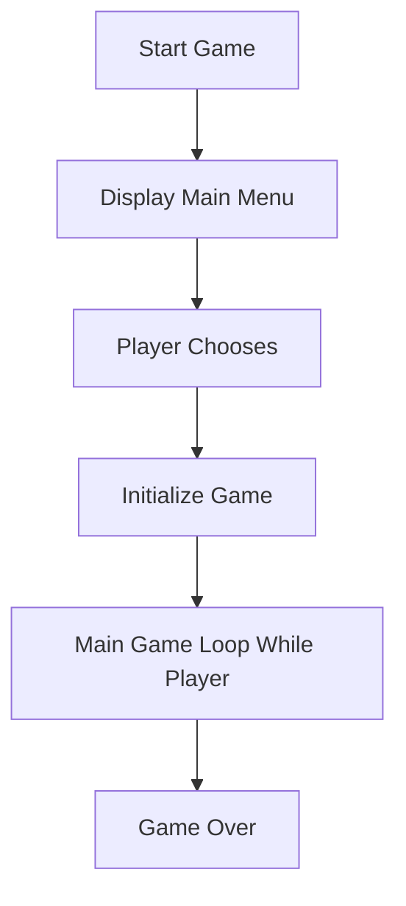

# UAS-PengenalanInformatika

# Hello Informatics !

## Menjelaskan dan Menginternalisasi Computational Thinking (V) ⭐⭐⭐⭐⭐⭐⭐

https://dhikaaprtma.wordpress.com/2023/12/26/pengenalan-informatika/

## Menjelaskan Jenis-Jenis Mesin Komputasi (V)⭐⭐⭐

https://dhikaaprtma.wordpress.com/2023/12/26/seni-menjalin-hubungan/

## Mengktifkan dan Mencoba Google Colab [v] ⭐⭐⭐⭐⭐

## Mencoba Console Sistem Operasi

### Windows CMD [v] ⭐⭐⭐⭐

Referensi [1](https://www.stationx.net/windows-command-line-cheat-sheet/)

### Linux Terminal Menggunakan Google Colab [v] ⭐⭐⭐⭐

## Membuat Algoritma Dalam Bentuk Flow Chart [v] ⭐⭐⭐⭐⭐

Referensi [1](https://dev.to/angelotheman/flowchart-wizardry-master-the-art-of-visualizing-algorithms-4e4j)

Contoh Flow chart tentang game yang telah di buat 

## Mencoba Scratch Bahasa Indonesia [v] ⭐⭐⭐⭐⭐⭐⭐

Referensi [1](https://scratch.mit.edu/)

## Mencoba Algoritma Bubble Sort Menggunakan Java [v] ⭐⭐⭐

https://drive.google.com/file/d/1Qg-w6YNgzoJJrKoP3U_IeHSYDor5O2rQ/view?usp=drive_link

public class BubbleSort {

    public static void main(String[] args) {
        int[] arr = {65, 27, 11, 39, 58, 76, 98};

        System.out.println("Array sebelum diurutkan:");
        printArray(arr);

        bubbleSort(arr);

        System.out.println("\nArray setelah diurutkan:");
        printArray(arr);
    }

    // Fungsi atau method untuk melakukan Bubble Sort
    static void bubbleSort(int[] arr) {
        int n = arr.length;
        for (int i = 0; i < n-1; i++) {
            for (int j = 0; j < n-i-1; j++) {
                if (arr[j] > arr[j+1]) {
                    // Tukar arr[j] dan arr[j+1]
                    int temp = arr[j];
                    arr[j] = arr[j+1];
                    arr[j+1] = temp;
                }
            }
        }
    }

    // Fungsi atau method untuk menampilkan array
    static void printArray(int[] arr) {
        for (int i=0; i < arr.length; ++i) {
            System.out.print(arr[i] + " ");
        }
        System.out.println();
    }
}

## Mencoba dan Mendemonstrasikan Penggunakan IDE ⭐⭐

## Mendaftar, Mengeksplorasi, dan Mendemonstrasikan Penggunaan HackerRank [v] ⭐⭐⭐⭐⭐

https://drive.google.com/file/d/1wFqSKASy_aAEfy5X_U1FQTrb-hucbUJd/view?usp=drive_link

## Mendemonstrasikan Pembuatan Aplikasi / Game Pada Platform : Mobile / Desktop / Web Browser (V) ⭐⭐⭐⭐⭐

Penjelasan coding atau pembuatan game (https://drive.google.com/file/d/1_FMRsrSkPIXsobya6KT3pwkz9Hxmq71C/view?usp=drive_link)

Demonstrasi Game (https://drive.google.com/file/d/1Z5U_mAxQnG8rrUKOK4BK9DOM71M5SGC-/view?usp=drive_link)

## Mencoba Instalasi Database (PostgreSQL / MySQL / dsb.) [v] ⭐⭐⭐

https://dhikaaprtma.wordpress.com/2023/12/27/menginstalasi-database/

Referensi installer [PostgreSQL](https://www.postgresql.org/download/windows/)
Referensi tambahan [1](https://db-engines.com/en/ranking)

## Mencoba Eksplorasi dan Query Database Menggunakan Database Explorer (Dbeaver / dsb.) [v] ⭐⭐⭐

Referensi installer [Dbeaver](https://dbeaver.io/download/)
Referensi [1](https://www.w3schools.com/postgresql/postgresql_create_table.php)

## Mendemonstrasikan dan Menjelaskan Penggunaan Web Browser untuk Mengakses Halaman Website HTML [v] ⭐⭐⭐⭐
- Dokumen HyperText Markup Language (HTML) ada untuk memudahkan pertukaran informasi berbasis Hypertext.
- Web Browser seperti Firefox, Chrome, Opera, ada untuk membuka dan mempresentasikan dokumen HTML
- Dokumen HTML ini bisa bersumber dari web server yang kita ingin datanya (Tokopedia, Wikipedia, Detik.com, dsb.) atau bisa juga dukumen HTML yang kita buat sendiri

## Mendemonstrasikan dan Menjelaskan Komponen Dari Contoh Uniform Resource Locator (URL) [v] ⭐⭐

Referensi: [1](https://www.startertutorials.com/ajwt/uniform-resource-locator.html)

## Mencoba Pelacakan Informasi Server dari Alamat Domain [v] ⭐

Referensi terkait: [1](https://en.wikipedia.org/wiki/Country_code_top-level_domain) [2](https://en.wikipedia.org/wiki/List_of_Internet_top-level_domains)

## Mencoba Pembuatan Halaman Web Menggunakan HTML, CSS, dan JavaScript [v] ⭐⭐⭐

Referensi tutorial 
- Isi konten halaman web : [HTML](https://www.w3schools.com/html/)
- Styling halaman web : [CSS](https://www.w3schools.com/css/)
- Interaktivitas halaman web : [JavaScript](https://www.w3schools.com/js/)

contoh demonstrasi tampilan halaman website (https://drive.google.com/file/d/1ZJGxEGCIsGcBaRM2R9qk5uxw9PNE9v7T/view?usp=drive_link)

penjelasan mengenai pembuatan halaman menggunakan struktur HTML 5 dan Desain menggunakan CSS (https://drive.google.com/file/d/1WMVwIlZPkE7_i2Mv93_Ai5s16r0t9Q_P/view?usp=drive_link)

## Mencoba Penerapan Teknik Search Engine Optimization (SEO) Pada HTML [v] ⭐⭐⭐

Referensi []

## Mencoba Pembuatan File JSON [v] ⭐⭐⭐

## Mencoba Penggunaan Web Hosting Dengan Untuk Halaman HTML [v] ⭐⭐⭐

## Mencoba Penggunaan Web Hosting Dengan Untuk Web Service [v] ⭐⭐⭐

## Mencoba HTTP Request dan Web API dengan Hoppscotch / Postman [v] ⭐⭐

## Mendemonstrasikan Penggunaan Developer Tools Pada Web Browser (Firefox / Chrome) [v] ⭐⭐⭐⭐⭐

## Mengeksplorasi dan Menjelaskan Layanan Cloud Service yang Diminati (GCP / AWS / Azure) [v] ⭐⭐
Saat ini banyak perusahaan berbasis digital seperti Gojek, Tokopedia, Instagram, Telkom memanfaatkan Cloud Service karena memudahkan untuk mulai pembangunan dan analisis menggunakan infrastruktur digital yang dapat berkembang secara dinamis dengan tarif yang sangat teliti.

Referensi cloud service: [Amazon Web Service](https://aws.amazon.com/) [Microsoft Azure](https://azure.microsoft.com) [Google Cloud Platform](https://cloud.google.com) 

## Mencoba Penggunaan Content Management System (Wordpress) [v] ⭐⭐⭐

https://dhikaaprtma.wordpress.com/

## Mendemonstrasikan Akses Konten Multimedia (Image, Audio, Video) ⭐⭐⭐

## Mencoba Edit Konten Multimedia (Image, Audio, Video) [v] ⭐⭐

## Mencoba Pembuatan Game dan Simulasi Menggunakan Logo [v] ⭐⭐

## Mencoba Pemrosesan Konten Multimedia (Image, Audio) Menggunakan Google Colab [v] ⭐⭐⭐

## Mencoba Web Tool AI Discriminative (Image Classification) [v] ⭐⭐⭐⭐

## Mencoba Web Tool AI Generative (Text to Image, Text to Text) [v] ⭐⭐⭐⭐

## Mencoba Model Machine Learning Menggunakan Google Colab, TTS, Speechrecognition, dan HuggingFace [v] ⭐⭐⭐

## Mencoba Data Visualization Dengan Tools [v] ⭐⭐

## Mencoba Data Visualization Dengan Code [v] ⭐⭐

## Mendaftar dan Mencoba Eksplorasi HuggingFace [v] ⭐⭐⭐

https://drive.google.com/file/d/1BoBCQqyBDr7Utc2IgSNNVo3-y_sZ2ALu/view?usp=drive_link

## Mendaftar dan Mencoba Eksplorasi Kaggle [v] ⭐⭐⭐⭐

https://drive.google.com/file/d/1A3wtTuAJ9wLghvSzuMJ7cG3fQaD6deFb/view?usp=drive_link

## Mencoba Protokol Komunikasi IoT (MQTT) [v] ⭐

https://dhikaaprtma.wordpress.com/2023/12/29/protokol-komunikasi-iot-mqtt/

## Mencoba Memproses File CSV Menggunakan Google Colab [v] ⭐⭐

## Mencoba Memproses File Big Data ORC Menggunakan Google Colab [v] ⭐⭐

## Menjelaskan Jurnal, Conference, Artikel, Grade Jurnal [v] ⭐⭐⭐⭐⭐

## Eksplorasi Artikel Jurnal / Conference di Repository Terekognisi Internasional (IEEE / Arxiv / Science Direct / ACM /DBLP) [v] ⭐⭐⭐⭐

## Menonton Video Presentasi Tugas Akhir Informatika ⭐⭐⭐⭐⭐

Disini saya menonton sebuah video persentasi tugas akhir dari NOVIANI JEMIMA UNIVERSITAS BINA SARANA INFORMATIKA

https://youtu.be/7rSyCTLLPT8?si=hJ61Ez_PDV6H-qPw

https://dhikaaprtma.wordpress.com/2023/12/29/menonton-tugas-akhir-informatika/

## Mengeksplorasi Seluruh Profesi Terkait Informatika dan Profesi yang Diminati ⭐⭐⭐⭐

https://dhikaaprtma.wordpress.com/2023/12/27/profesi-terkait-informatika-dan-profesi-yang-diminati/

## Eksplorasi Tools Untuk Belajar Bahasa Inggris (Duolingo) ⭐⭐⭐

https://drive.google.com/file/d/1ZS_objAVZh5qx2NpNsnujmGThB-wEvW_/view?usp=drive_link

## Eksplorasi Tools Untuk Belajar Berbicara Bahasa Inggris (HelloTalk) ⭐⭐⭐ 

https://drive.google.com/file/d/1bHHiAD8pZs9__WzkjG5rCVsqFo-O5LDh/view?usp=drive_link

## Eksplorasi Lowongan Pekerjaan IT ⭐⭐⭐

https://drive.google.com/file/d/1YdZW0N5vS5HTsSg2zlODChJMd14on5hR/view?usp=drive_link

## Eksplorasi Lowongan Freelancer IT (Upwork / Toptal / Freelancer.com) ⭐⭐⭐

https://drive.google.com/file/d/1E4yu8rtP-LT-VimIrZiLbIUYGAHDz2oM/view?usp=drive_link

## Eksplorasi dan Pilih Topik yang Diminati di Roadmap.sh ⭐⭐⭐

https://drive.google.com/file/d/14DQ5KsB_LrJR6FAZrrfjUKCC9F-b7VTR/view?usp=drive_link

## Eksplorasi Top Github Project yang Diminati ⭐⭐ 

https://drive.google.com/file/d/111_dW_N_ATGiTnWx9FdDIwlBJ8m_lSzo/view?usp=drive_link

## Membangun Profil Linkedin dan Mengikuti Akun-Akun Inspirasif Bertema Informatika ⭐⭐⭐

https://www.linkedin.com/in/andhika-pratama-k-1359462a6/

## Membangun Profil Github Page ⭐⭐⭐⭐⭐

https://github.com/Dhikaaprtmaa

## Mengikuti Workshop / Event / Course Terkait IT ⭐⭐⭐⭐

https://dhikaaprtma.wordpress.com/2023/12/26/melampaui-hambatan/

## Membaca dan Mengambil Inspirasi Dari Buku Bertema Informatika ⭐⭐⭐⭐⭐

(https://dhikaaprtma.wordpress.com/2023/12/27/membaca-buku-informatika/)
